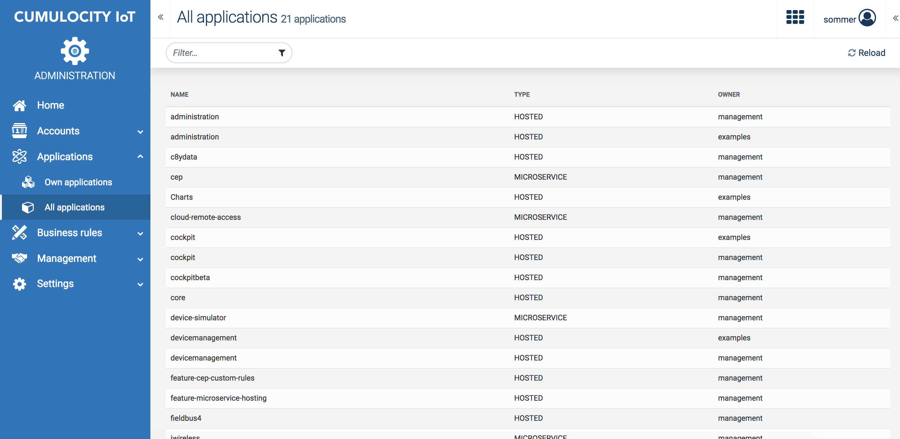
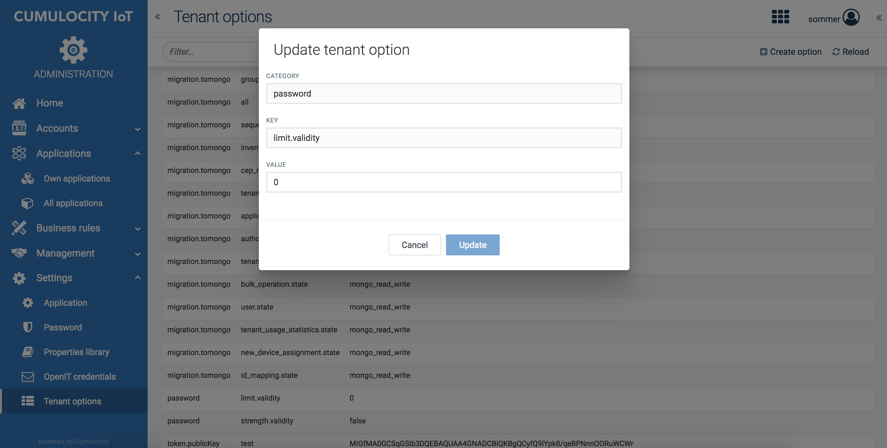

# Cumulocity UI enhancements
This repository provides a couple of helpful plugins that can be added to the default Cumulocity application.
The plugins are more in the category of easing setup or managing the tenant.
While probably not helpful for the end user they can speed up some interactions that otherwise need to be done via the REST API.

# Content
* [Prerequisites](#prerequisites)
* [Deployment](#deployment)
* [Available plugins](#available-plugins)
  * [All applications](#all-applications)
  * [Tenant options](#tenant-options)
  * [Dashboard export/import](#dashboard-utils)

# <a name="prerequisites"></a>Prerequisites

In order to run the project you will need to setup
  1. Node.js (8.9.0 or newer)
  2. npm
  3. Cumulocity CLI [cumulocity-tools](https://www.npmjs.com/package/cumulocity-tools)
  4. An account on a Cumulocity based system (free trial at [Cumulocity](https://cumulocity.com/))
  
If you have never worked with a Cumulocity UI application I recommend following the [basic introduction](https://cumulocity.com/guides/web/introduction/) to get started.

# <a name="deployment"></a>Deployment

In order to to deploy the additional plugins you need to do the following steps:

  1. Clone the repository
  2. Inside the repository install the dependencies using these two commands:
  ```
  npm install
  c8y install <version>
  ```
  Please check inside your Cumulocity account which version the UI is currently running on. I recommend to always use the same version when using this repository.
  3. Inside the repository deploy the plugins using:
  ```
  c8y deploy:target enhancement
  ```
  This will prompt you with your url, tenant, username and password.

# <a name="available-plugins"></a>Available plugins

## <a name="all-applications"></a>All applications

|Application|Type|
|---|---|
|Administration|Navigation plugin|

Versions tested:
* 8.19.16
* 9.10.0
* 9.11.3

*Note: This plugin only uses application API and therefore should also work on older versions*

This plugin lists all applications that are available within your tenant. While "Own applications" only lists the applications created by you this plugin also shows the applications that were subscribed to your tenant by your parent tenant. 
Note that currently this list cannot display whether your application is actually subscribed to your tenant or not (the API does not have this information currently). For applications not owned by you it is guaranteed that they are subscribed to your tenant because otherwise you wouldn't see them.



## <a name="tenant-options"></a>Tenant options

|Application|Type|
|---|---|
|Administration|Navigation plugin|

Versions tested:
* 8.19.16
* 9.10.0
* 9.11.3

*Note: This plugin only uses tenant option API and therefore should also work on older versions*

This plugin allows you CRUD operations for the tenant options. If you see tenant options and don't know what they mean I highly recommend to not change them. Some of the tenant options can also be changed through default UIs. This plugin gives you the raw view on all of them.





## <a name="dashboard-utils"></a>Dashboard export/import

|Application|Type|
|---|---|
|Cockpit|Action menu entry|

Versions tested:
* 8.19.16
* 9.10.0
* 9.11.3

This plugin allows you to export your dashboards in a zip containing all configuration information and also external files (like images or SVGs) if present.
Additionally you can also import the zip files into a tenant. This should speed up your time-to-demo for once created demos. Upon import of the zip you will prompted to link the dashboard again to devices if your widgets referenced devices or data from devices.


